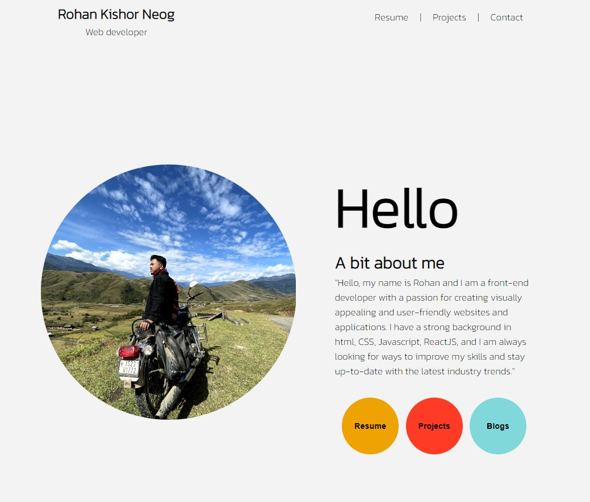

# personal-website

   

        

            

                <h3>Mark 5</h3>
                <h4>Portfolio</h4>
                
My portfolio website is a project that I developed to showcase my skills and accomplishments as a web
                    developer. The goal of the website is to demonstrate my expertise in web dev skills and to provide
                    potential clients or employers with a clear and concise overview of my work.

            

            

                    <a  class="button" href='https://rohankishorneog.netlify.app'>Live</a>
            

        

        

    

